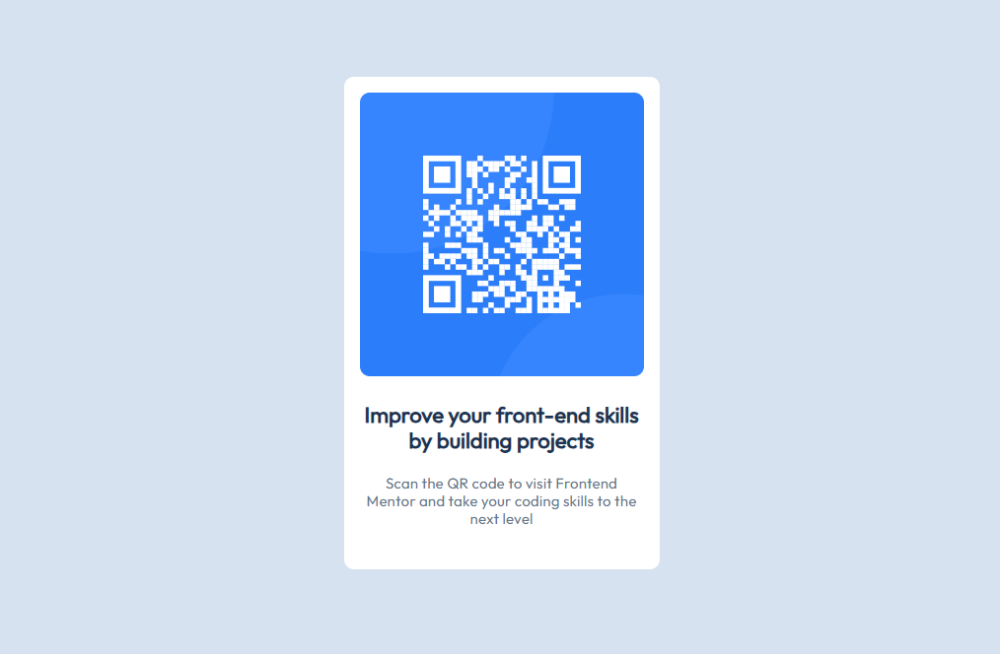

# Frontend Mentor - QR code component solution

This is a solution to the [QR code component challenge on Frontend Mentor](https://www.frontendmentor.io/challenges/qr-code-component-iux_sIO_H). Frontend Mentor challenges help you improve your coding skills by building realistic projects.

## Table of contents

- [Overview](#overview)
  - [Screenshot](#screenshot)
  - [Links](#links)
- [My process](#my-process)
  - [Built with](#built-with)
- [Author](#author)

## Overview

### Screenshot

### Links

- Solution URL: [https://github.com/minjikim19/QR-Code-Challenge](https://github.com/minjikim19/QR-Code-Challenge)
- Live Site URL: [https://minjikim19.github.io/QR-Code-Challenge/](https://minjikim19.github.io/QR-Code-Challenge/)

## My process

### Built with

- Semantic HTML5 markup
- CSS custom properties
- Flexbox
- CSS Grid

## Author

- Website - [Minji Kim](https://minjikim19.github.io/minji-website/)
- Frontend Mentor - [@minjikim19](https://www.frontendmentor.io/profile/minjikim19)
